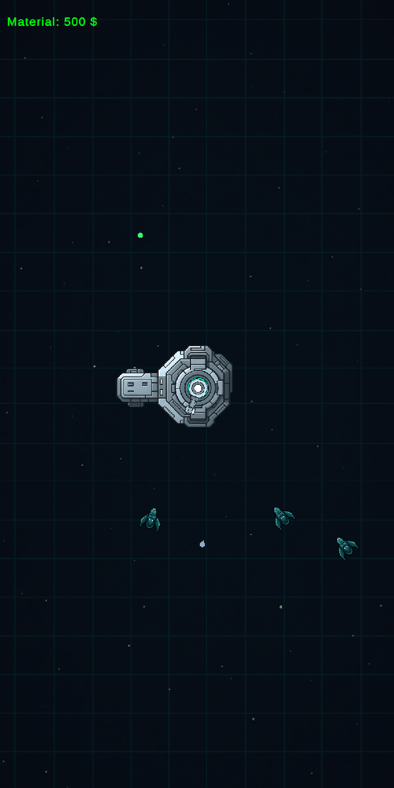

# Aegis Protocol

**Aegis Protocol** is a top-down sci-fi defense prototype about protecting a space station from incoming threats.

## Highlights
- Build defensive modules, towers and shields around the station.
- Manage resources and unlock upgrades.
- Face enemy waves and track the score.
- Save and resume local progress.

## Development
- **Engine:** Unity 6000.0.59f2
- **Status:** Waiting

## Run locally
1. Clone the repository.
2. Open it in Unity Hub with the listed Unity version.
3. Open a gameplay scene in `Assets/GameContent/Scenes` and press Play.
