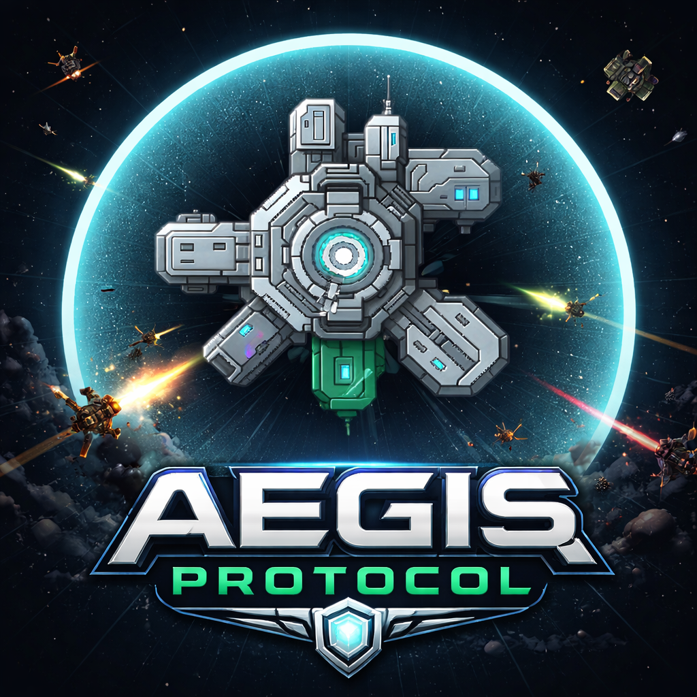

# Aegis Protocol

  

<strong>A top-down sci-fi defense game about protecting a space station under siege.</strong>

  
  
  

## About

**Aegis Protocol** is a top-down sci-fi defense prototype about turning a vulnerable station into a resilient stronghold while hostile forces close in.

## Highlights

- **Fortify the station:** Build defensive modules, towers and shields around the station.
- **Prepare for waves:** Manage resources, unlock upgrades and respond to escalating threats.
- **Track progress:** Score systems and local saves support repeatable runs.

## Technical details

- **Engine:** Unity `6000.3.15f1`
- **Status:** On hold

## Run locally

1. Clone the repository.
2. Open it in Unity Hub with Unity `6000.3.15f1`.
3. Open a gameplay scene in `Assets/GameContent/Scenes` and press Play.
